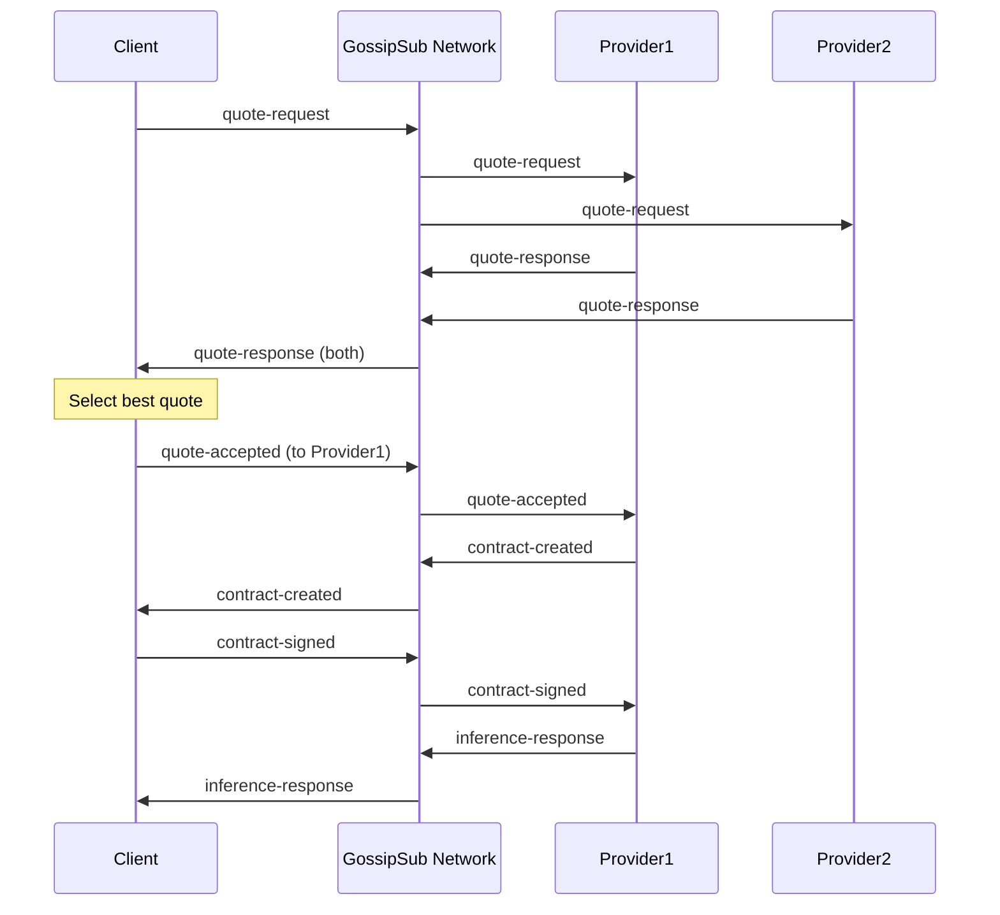
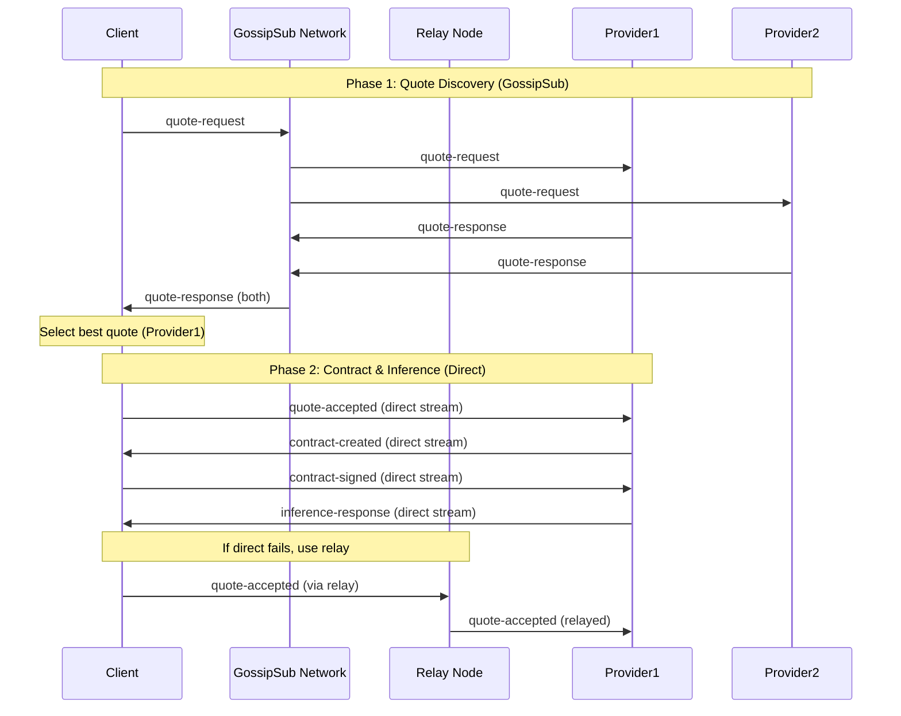
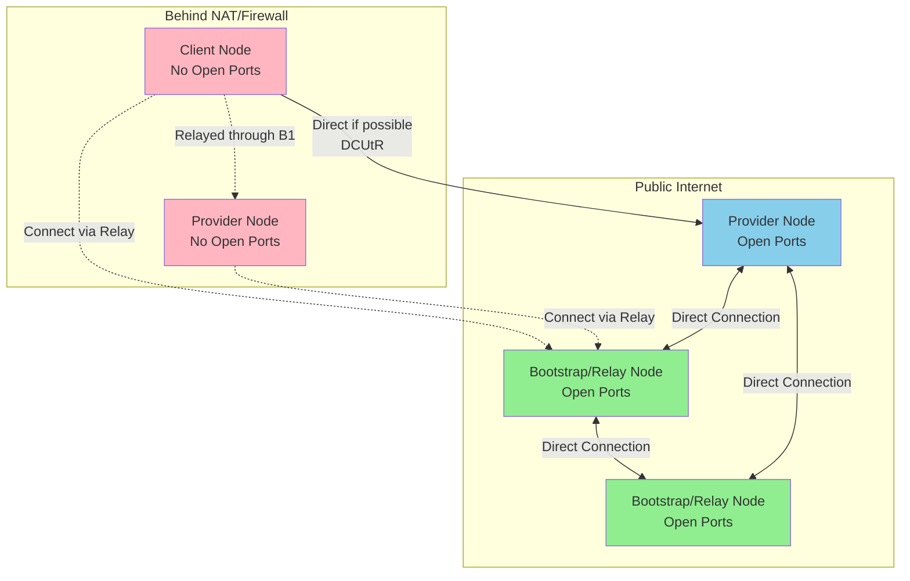
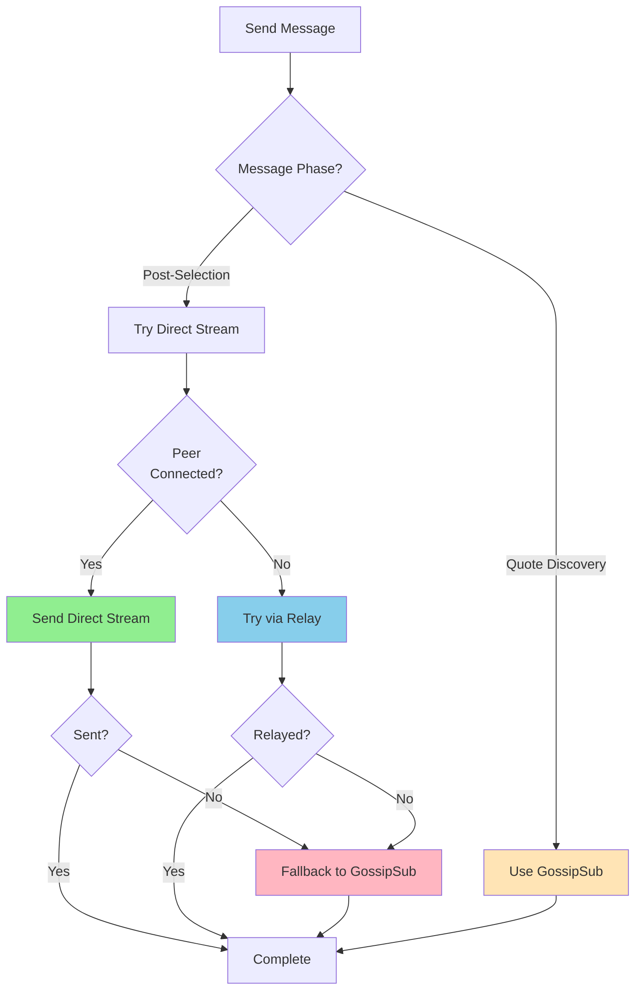

# DIIISCO Direct Messaging & Relay Architecture Plan

## Overview

This document outlines the architectural plan to optimize DIIISCO node communication by:
1. Keeping quote-request/quote-response on LibP2P gossipsub (broadcast for quote discovery)
2. Moving post-quote-selection messages to direct peer-to-peer streams (faster, more efficient)
3. Supporting nodes with and without open ports via circuit relay
4. Implementing automatic fallback to gossipsub for reliability

## Current Architecture

### Message Flow (All via GossipSub)



### Issues with Current Approach
- All messages broadcast even when targeted to specific peer
- Increased latency for post-selection messages
- Unnecessary network overhead
- Less privacy for contract details

## Proposed Architecture

### Hybrid Message Flow (GossipSub + Direct Streams)



### Network Topology with Circuit Relay



## Key Components

### 1. LibP2P Services to Add

#### AutoNAT Service
- **Purpose**: Detect if node has public accessibility
- **Action**: Determines if node should act as relay server
- **Configuration**: Automatic detection with manual override

#### Circuit Relay v2
- **Server Mode**: For nodes with open ports (bootstrap nodes, public servers)
- **Client Mode**: For all nodes to use relays when needed
- **Features**: 
  - Limited relayed connections per server (resource management)
  - Automatic relay discovery
  - Connection reservation system

#### DCUtR (Direct Connection Upgrade through Relay)
- **Purpose**: Upgrade relayed connections to direct when possible
- **Benefit**: Start with relay, switch to direct for better performance
- **Use Case**: Hole-punching for nodes behind symmetric NAT

### 2. Direct Messaging Protocol

#### Custom Protocol Definition
```typescript
const DIIISCO_DIRECT_PROTOCOL = '/diiisco/direct/1.0.0'
```

#### Message Handler Implementation
```typescript
interface DirectMessageHandler {
  // Register protocol handler
  registerProtocol(): void;
  
  // Send direct message with fallback
  sendDirect(peerId: string, message: PubSubMessage): Promise<boolean>;
  
  // Handle incoming direct messages
  handleIncoming(stream: Stream): Promise<void>;
}
```

### 3. Message Routing Logic



### 4. Configuration Schema

```typescript
interface RelayConfig {
  // Enable/disable relay server functionality
  enableRelayServer: boolean;
  
  // Auto-detect if node should be relay based on AutoNAT
  autoEnableRelay: boolean;
  
  // Maximum relayed connections to handle (if relay server)
  maxRelayedConnections: number;
  
  // Enable relay client (use relays to connect)
  enableRelayClient: boolean;
  
  // Enable DCUtR for connection upgrades
  enableDCUtR: boolean;
}

interface DirectMessagingConfig {
  // Enable direct messaging for post-quote-selection messages
  enableDirectMessaging: boolean;
  
  // Timeout for direct message attempts (ms)
  directMessageTimeout: number;
  
  // Fallback to gossipsub on direct failure
  fallbackToGossipsub: boolean;
  
  // Messages that should use direct messaging
  directMessageTypes: MessageRole[];
}
```

## Implementation Phases

### Phase 1: Infrastructure Setup
1. Add required LibP2P packages:
   - `@libp2p/autonat`
   - `@libp2p/circuit-relay-v2`
   - `@libp2p/dcutr`

2. Update [`node.ts`](../src/libp2p/node.ts) configuration:
   - Add AutoNAT service
   - Add circuit relay service (both modes)
   - Add DCUtR service
   - Configure connection limits

3. Create environment configuration:
   - Add relay settings to [`environment.types.ts`](../src/environment/environment.types.ts)
   - Add direct messaging settings
   - Set sensible defaults

### Phase 2: Direct Messaging Implementation
1. Create new module [`src/messaging/directMessaging.ts`]:
   - Protocol registration
   - Stream handling
   - Message encoding/decoding
   - Error handling

2. Create routing layer [`src/messaging/messageRouter.ts`]:
   - Determine message delivery method
   - Attempt direct first
   - Fallback to gossipsub
   - Track delivery success/failure

3. Add connection tracking [`src/messaging/connectionTracker.ts`]:
   - Track peer capabilities (direct, relay, gossipsub-only)
   - Cache last successful connection method
   - Monitor connection health

### Phase 3: Handler Updates
1. Update [`pubsub/handler.ts`](../src/pubsub/handler.ts):
   - Add message routing logic
   - Switch post-selection messages to direct
   - Maintain gossipsub for discovery phase
   - Handle both incoming direct and gossipsub messages

2. Update message types in [`types/messages.ts`](../src/types/messages.ts):
   - Add delivery metadata
   - Track delivery method used
   - Add correlation IDs for debugging

3. Update [`index.ts`](../src/index.ts):
   - Initialize direct messaging protocol
   - Setup connection tracking
   - Add event listeners for relay events

### Phase 4: Testing & Validation
1. Create test scenarios:
   - Direct connection (both nodes public)
   - Relayed connection (one or both behind NAT)
   - DCUtR upgrade (relay → direct)
   - Fallback to gossipsub (direct fails)
   - Mixed topology (some direct, some relayed)

2. Performance testing:
   - Measure latency improvement
   - Monitor relay load
   - Test failover scenarios

3. Integration testing:
   - End-to-end quote flow
   - Contract creation and signing
   - Inference delivery

### Phase 5: Documentation & Deployment
1. Update README with:
   - New configuration options
   - Relay server setup guide
   - NAT traversal explanation

2. Create deployment guides:
   - Bootstrap/relay node setup
   - Firewall configuration
   - Port forwarding instructions

3. Migration guide:
   - Backward compatibility considerations
   - Gradual rollout strategy
   - Monitoring recommendations

## Technical Details

### Message Type Classification

#### GossipSub Messages (Broadcast Discovery)
- `list-models` - Discover available models
- `list-models-response` - Advertise available models
- `quote-request` - Broadcast request for quotes
- `quote-response` - Respond with quotes

#### Direct Stream Messages (Peer-to-Peer)
- `quote-accepted` - Client → Selected Provider
- `contract-created` - Provider → Client
- `contract-signed` - Client → Provider
- `inference-response` - Provider → Client

### Connection Strategy

```typescript
enum ConnectionMethod {
  DIRECT = 'direct',       // Direct TCP connection
  RELAYED = 'relayed',     // Via circuit relay
  DCUTR = 'dcutr',        // Upgraded through DCUtR
  GOSSIPSUB = 'gossipsub'  // Fallback broadcast
}

class ConnectionStrategy {
  async selectMethod(peerId: string): Promise<ConnectionMethod> {
    // 1. Try cached successful method first
    const cached = this.cache.get(peerId);
    if (cached && this.isMethodAvailable(cached)) {
      return cached;
    }
    
    // 2. Check if peer is directly connected
    const connections = node.getConnections(peerId);
    if (connections.some(c => !c.remoteAddr.toString().includes('/p2p-circuit/'))) {
      return ConnectionMethod.DIRECT;
    }
    
    // 3. Try establishing direct connection
    try {
      await node.dial(peerId);
      return ConnectionMethod.DIRECT;
    } catch (err) {
      // Direct failed, try relay
    }
    
    // 4. Try relay connection
    if (await this.tryRelay(peerId)) {
      return ConnectionMethod.RELAYED;
    }
    
    // 5. Fallback to gossipsub
    return ConnectionMethod.GOSSIPSUB;
  }
}
```

### Error Handling & Retry Logic

```typescript
class DirectMessageSender {
  async sendWithFallback(
    peerId: string, 
    message: PubSubMessage
  ): Promise<DeliveryResult> {
    const startTime = Date.now();
    
    try {
      // Attempt 1: Direct stream
      const result = await this.sendDirect(peerId, message);
      if (result.success) {
        logger.info(`✅ Direct message delivered in ${Date.now() - startTime}ms`);
        return { method: 'direct', success: true, latency: Date.now() - startTime };
      }
    } catch (err) {
      logger.warn(`⚠️ Direct message failed: ${err.message}`);
    }
    
    try {
      // Attempt 2: Relayed stream
      const result = await this.sendViaRelay(peerId, message);
      if (result.success) {
        logger.info(`✅ Relayed message delivered in ${Date.now() - startTime}ms`);
        return { method: 'relayed', success: true, latency: Date.now() - startTime };
      }
    } catch (err) {
      logger.warn(`⚠️ Relayed message failed: ${err.message}`);
    }
    
    // Attempt 3: Fallback to gossipsub
    logger.info(`📡 Falling back to GossipSub for message to ${peerId}`);
    await this.sendViaGossipsub(message);
    return { method: 'gossipsub', success: true, latency: Date.now() - startTime };
  }
}
```

### Relay Server Resource Management

```typescript
const relayConfig = {
  // Limit concurrent relayed connections
  maxConnections: 100,
  
  // Maximum duration for a relayed connection
  maxDuration: 300000, // 5 minutes
  
  // Data transfer limits per relayed connection
  maxDataPerConnection: 100 * 1024 * 1024, // 100 MB
  
  // Reservation system
  reservations: {
    maxReservations: 200,
    maxReservationTTL: 3600000, // 1 hour
  }
};
```

## Benefits of New Architecture

### Performance Improvements
- **Lower Latency**: Direct connections avoid gossipsub propagation delay
- **Reduced Bandwidth**: No broadcast overhead for targeted messages
- **Better Scalability**: Network scales more efficiently with direct messaging

### Privacy & Security
- **Message Privacy**: Contract details not broadcast to entire network
- **Targeted Delivery**: Only intended recipient receives sensitive data
- **Cryptographic Protection**: Messages still signed and verified

### Network Resilience
- **Fallback Mechanism**: Automatic degradation to gossipsub ensures reliability
- **NAT Traversal**: Circuit relay enables communication for all node types
- **Connection Upgrades**: DCUtR optimizes connections dynamically

### Operational Flexibility
- **Support All Node Types**: Works for nodes with and without public ports
- **Minimal Configuration**: Auto-detection and sensible defaults
- **Backward Compatible**: Can coexist with gossipsub-only nodes during migration

## Monitoring & Observability

### Metrics to Track
```typescript
interface MessagingMetrics {
  // Delivery method breakdown
  directMessages: number;
  relayedMessages: number;
  gossipsubMessages: number;
  
  // Success rates
  directSuccessRate: number;
  relaySuccessRate: number;
  
  // Performance
  averageDirectLatency: number;
  averageRelayLatency: number;
  averageGossipsubLatency: number;
  
  // Relay server stats (if applicable)
  activeRelayedConnections: number;
  totalRelayedData: number;
  relayConnectionsRejected: number;
}
```

### Logging Strategy
- Log connection method selection and reasoning
- Track fallback occurrences and reasons
- Monitor relay usage and capacity
- Alert on high fallback rates (may indicate connectivity issues)

## Security Considerations

### Message Authentication
- All messages (direct and gossipsub) must be signed
- Verify Algorand wallet signatures before processing
- Reject messages with invalid signatures

### Relay Trust
- Circuit relays cannot read message content (encrypted streams)
- Relays can see source/destination peer IDs
- Consider trusted relay lists for sensitive deployments

### DoS Prevention
- Rate limit direct message streams per peer
- Enforce relay resource limits
- Monitor for abuse patterns

## Migration Strategy

### Gradual Rollout
1. **Phase A**: Deploy with feature flag disabled (code in place, not active)
2. **Phase B**: Enable for test network nodes only
3. **Phase C**: Enable on select production nodes (opt-in)
4. **Phase D**: Enable by default with gossipsub fallback
5. **Phase E**: Eventually deprecate gossipsub for post-selection messages (optional)

### Backward Compatibility
- Old nodes continue using gossipsub for all messages
- New nodes support both methods
- Message handlers check for both delivery paths
- No breaking changes to message formats

### Testing Checklist
- [ ] Direct connection between public nodes
- [ ] Relayed connection through bootstrap node
- [ ] DCUtR connection upgrade
- [ ] Fallback when direct fails
- [ ] Mixed network (direct + relay + gossipsub-only nodes)
- [ ] Relay server under load
- [ ] Connection persistence across disconnects
- [ ] Message delivery guarantees

## Open Questions & Future Enhancements

### Questions to Resolve
1. Should relay servers prioritize certain peers (e.g., bootstrap nodes, high-stake providers)?
2. How to handle message ordering guarantees for direct streams?
3. Should there be a reputation system for relay servers?

### Future Enhancements
- **WebRTC Transports**: For browser-based nodes
- **QUIC Transport**: Better performance for direct connections
- **Peer Scoring**: Route through more reliable peers
- **Message Compression**: Reduce bandwidth for large inference responses
- **Streaming Responses**: Stream inference tokens as they're generated

## References

### LibP2P Documentation
- [Circuit Relay v2](https://docs.libp2p.io/concepts/nat/circuit-relay/)
- [AutoNAT](https://docs.libp2p.io/concepts/nat/autonat/)
- [DCUtR](https://docs.libp2p.io/concepts/nat/dcutr/)
- [Custom Protocols](https://docs.libp2p.io/concepts/protocols/)

### Implementation Examples
- [js-libp2p circuit relay examples](https://github.com/libp2p/js-libp2p/tree/main/examples)
- [Direct messaging patterns](https://github.com/libp2p/js-libp2p/tree/main/examples/echo)

---

## Summary

This architecture enhances DIIISCO by:
1. ✅ Keeping quote discovery decentralized via gossipsub
2. ✅ Optimizing post-selection messages with direct streams
3. ✅ Supporting all node types via circuit relay
4. ✅ Maintaining reliability with automatic fallback
5. ✅ Enabling automatic relay server functionality on capable nodes

The implementation is designed to be **incremental, backward-compatible, and operationally flexible**, ensuring smooth adoption across the network.
