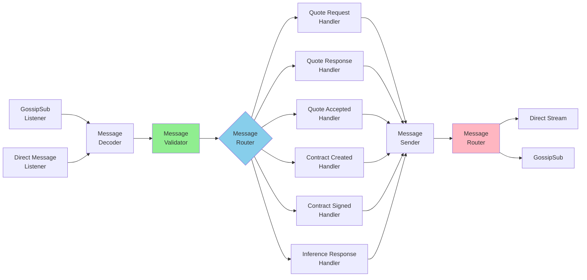
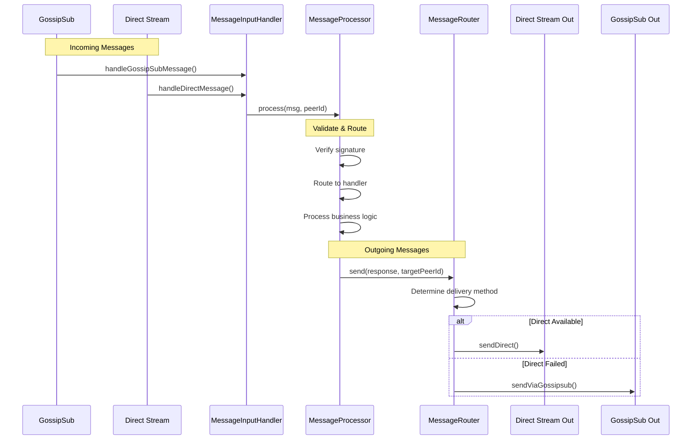

# Unified Message Handler Architecture

## Problem Statement

The initial implementation guide suggested handling messages from gossipsub and direct streams separately, which would lead to code duplication. This document shows the improved architecture with a single, unified message handler.

## Architecture Principle

**All messages, regardless of delivery method (gossipsub, direct, or relayed), flow through a single message processor.**



## Implementation

### Step 1: Create Unified Message Processor

**New File**: `src/messaging/messageProcessor.ts`

```typescript
import { PubSubMessage, QuoteRequest, QuoteResponse, QuoteAccepted, 
         ContractCreated, ContractSigned, InferenceResponse } from '../types/messages';
import { logger } from '../utils/logger';
import algorand from '../utils/algorand';
import { OpenAIInferenceModel } from '../utils/models';
import quoteEngine from '../utils/quoteEngine';
import diiiscoContract from '../utils/contract';
import { RawQuote } from '../types/quotes';
import { EventEmitter } from 'events';
import { Address } from 'algosdk';

/**
 * Unified message processor - handles all messages regardless of delivery method
 */
export class MessageProcessor {
  constructor(
    private algo: algorand,
    private model: OpenAIInferenceModel,
    private quoteMgr: quoteEngine,
    private availableModels: string[],
    private nodeEvents: EventEmitter,
    private sendMessage: (message: PubSubMessage, targetPeerId?: string) => Promise<void>
  ) {}

  /**
   * Process any incoming message from any source
   * @param msg The decoded message
   * @param sourcePeerId The peer ID that sent the message
   * @returns true if processed successfully
   */
  async process(msg: PubSubMessage, sourcePeerId: string): Promise<boolean> {
    // Step 1: Validate Algorand address
    if (!msg.fromWalletAddr || !this.algo.isValidAddress(msg.fromWalletAddr)) {
      logger.warn("❌ Message rejected due to invalid Algorand address.");
      return false;
    }

    // Step 2: Validate signature
    if (!msg.signature) {
      logger.warn("❌ Message rejected due to missing signature.");
      return false;
    }

    const verifiedMessage = await this.algo.verifySignature(msg);
    if (!verifiedMessage) {
      logger.warn("❌ Message rejected due to invalid signature.");
      return false;
    }

    logger.info(`🔐 Signature verified for ${msg.role} from ${sourcePeerId}`);

    // Step 3: Route to appropriate handler
    try {
      switch (msg.role) {
        case 'list-models':
          return await this.handleListModels(msg, sourcePeerId);
        
        case 'list-models-response':
          return await this.handleListModelsResponse(msg as any, sourcePeerId);
        
        case 'quote-request':
          return await this.handleQuoteRequest(msg as QuoteRequest, sourcePeerId);
        
        case 'quote-response':
          return await this.handleQuoteResponse(msg as QuoteResponse, sourcePeerId);
        
        case 'quote-accepted':
          return await this.handleQuoteAccepted(msg as QuoteAccepted, sourcePeerId);
        
        case 'contract-created':
          return await this.handleContractCreated(msg as ContractCreated, sourcePeerId);
        
        case 'contract-signed':
          return await this.handleContractSigned(msg as ContractSigned, sourcePeerId);
        
        case 'inference-response':
          return await this.handleInferenceResponse(msg as InferenceResponse, sourcePeerId);
        
        default:
          logger.warn(`⚠️ Unknown message role: ${msg.role}`);
          return false;
      }
    } catch (err: any) {
      logger.error(`❌ Error processing ${msg.role}: ${err.message}`);
      return false;
    }
  }

  // ============================================================================
  // Individual Message Handlers
  // ============================================================================

  private async handleListModels(msg: any, sourcePeerId: string): Promise<boolean> {
    const models_list = await this.model.getModels();
    const response: any = {
      role: 'list-models-response',
      timestamp: Date.now(),
      id: msg.id,
      to: sourcePeerId,
      fromWalletAddr: this.algo.account.addr.toString(),
      payload: {
        models: models_list,
      }
    };
    
    response.signature = await this.algo.signObject(response);
    await this.sendMessage(response, sourcePeerId);
    logger.info(`📤 Sent list-models-response to ${sourcePeerId}`);
    return true;
  }

  private async handleListModelsResponse(msg: any, sourcePeerId: string): Promise<boolean> {
    this.model.addModel(msg.payload.models);
    logger.info(`📥 Received list-models-response from ${sourcePeerId}`);
    return true;
  }

  private async handleQuoteRequest(msg: QuoteRequest, sourcePeerId: string): Promise<boolean> {
    // Check if we have the requested model
    if (!this.availableModels.includes(msg.payload.model)) {
      logger.debug(`⏩ Skipping quote request - model ${msg.payload.model} not available`);
      return false;
    }

    // Check if requester is opted in to DSCO
    const optInStatus = await this.algo.checkIfOptedInToAsset(
      msg.fromWalletAddr, 
      diiiscoContract.asset
    );
    
    if (!optInStatus.optedIn) {
      logger.warn(`❌ Quote request from ${msg.fromWalletAddr} rejected - not opted in`);
      return false;
    }

    // Generate quote
    const rawQuote: RawQuote | null = await this.quoteMgr.createQuote(msg, this.model);
    if (rawQuote === null) {
      logger.warn(`❌ Unable to generate quote for ${msg.fromWalletAddr}`);
      return false;
    }

    // Create and send quote response
    const response: QuoteResponse = {
      role: 'quote-response',
      timestamp: Date.now(),
      id: msg.id,
      to: sourcePeerId,
      fromWalletAddr: this.algo.account.addr.toString(),
      payload: {
        ...msg.payload,
        quote: {
          model: msg.payload.model,
          inputCount: msg.payload.inputs.length,
          tokenCount: rawQuote.tokens,
          pricePer1K: rawQuote.rate,
          totalPrice: rawQuote.price,
          addr: this.algo.account.addr.toString(),
        },
      }
    };

    response.signature = await this.algo.signObject(response);
    await this.sendMessage(response, sourcePeerId);
    logger.info(`📤 Sent quote-response to ${sourcePeerId}`);
    return true;
  }

  private async handleQuoteResponse(msg: QuoteResponse, sourcePeerId: string): Promise<boolean> {
    logger.info(`📥 Received quote-response from ${sourcePeerId}`);
    this.quoteMgr.addQuote({ msg, from: sourcePeerId });
    return true;
  }

  private async handleQuoteAccepted(msg: QuoteAccepted, sourcePeerId: string): Promise<boolean> {
    // Create contract on Algorand
    await this.algo.createQuote({
      quoteId: msg.id,
      customerAddress: msg.fromWalletAddr,
      usdcAmount: BigInt(msg.payload.quote.totalPrice * 1_000_000),
    });

    // Send contract created response
    const response: ContractCreated = {
      ...msg,
      role: "contract-created",
      timestamp: Date.now(),
      to: sourcePeerId,
      fromWalletAddr: this.algo.account.addr.toString(),
    };

    response.signature = await this.algo.signObject(response);
    await this.sendMessage(response, sourcePeerId);
    logger.info(`📤 Sent contract-created to ${sourcePeerId}`);
    return true;
  }

  private async handleContractCreated(msg: ContractCreated, sourcePeerId: string): Promise<boolean> {
    // Fund the contract
    await this.algo.fundQuote({
      quoteId: msg.id,
      usdcAmount: BigInt(msg.payload.quote.totalPrice * 1_000_000),
    });

    // Send contract signed response
    const response: ContractSigned = {
      ...msg,
      role: "contract-signed",
      timestamp: Date.now(),
      to: sourcePeerId,
      fromWalletAddr: this.algo.account.addr.toString(),
    };

    response.signature = await this.algo.signObject(response);
    await this.sendMessage(response, sourcePeerId);
    logger.info(`📤 Sent contract-signed to ${sourcePeerId}`);
    return true;
  }

  private async handleContractSigned(msg: ContractSigned, sourcePeerId: string): Promise<boolean> {
    // Verify contract is funded
    const funded = await this.algo.verifyQuoteFunded(msg.id);
    if (!funded.funded || funded.usdcAmount < BigInt(msg.payload.quote.totalPrice * 1_000_000)) {
      logger.warn(`❌ Contract ${msg.id} is not funded. Cannot proceed.`);
      return false;
    }

    // Execute inference
    const completion = await this.model.getResponse(
      msg.payload.model, 
      msg.payload.inputs
    );

    // Send inference response
    const response: InferenceResponse = {
      role: 'inference-response',
      to: sourcePeerId,
      timestamp: Date.now(),
      id: msg.id,
      fromWalletAddr: this.algo.account.addr.toString(),
      payload: {
        ...msg.payload,
        completion: completion,
      }
    };

    response.signature = await this.algo.signObject(response);
    await this.sendMessage(response, sourcePeerId);
    logger.info(`📤 Sent inference-response to ${sourcePeerId}`);
    return true;
  }

  private async handleInferenceResponse(msg: InferenceResponse, sourcePeerId: string): Promise<boolean> {
    logger.info(`📥 Received inference-response from ${sourcePeerId}`);
    
    // Complete payment
    const payment = await this.algo.completeQuote({ 
      quoteId: msg.id, 
      provider: Address.fromString(msg.fromWalletAddr) 
    });

    // Emit event for API consumers
    this.nodeEvents.emit(`inference-response-${msg.id}`, { 
      ...msg, 
      payment, 
      quote: msg.payload.quote 
    });

    return true;
  }
}
```

---

### Step 2: Create Message Input Handler

**New File**: `src/messaging/messageInput.ts`

```typescript
import { decode } from 'msgpackr';
import { PubSubMessage } from '../types/messages';
import { logger } from '../utils/logger';
import { MessageProcessor } from './messageProcessor';

/**
 * Handles incoming messages from ALL sources and routes to unified processor
 */
export class MessageInputHandler {
  constructor(private processor: MessageProcessor) {}

  /**
   * Handle message from GossipSub
   */
  async handleGossipSubMessage(evt: any): Promise<void> {
    try {
      const msg: PubSubMessage = decode(evt.detail.data);
      const sourcePeerId = evt.detail.from.toString();
      
      logger.debug(`📡 Received gossipsub message: ${msg.role} from ${sourcePeerId}`);
      await this.processor.process(msg, sourcePeerId);
    } catch (err: any) {
      logger.error(`❌ Error handling gossipsub message: ${err.message}`);
    }
  }

  /**
   * Handle message from Direct Stream
   */
  async handleDirectMessage(data: Uint8Array, sourcePeerId: string): Promise<void> {
    try {
      const msg: PubSubMessage = decode(data);
      
      logger.debug(`📨 Received direct message: ${msg.role} from ${sourcePeerId}`);
      await this.processor.process(msg, sourcePeerId);
    } catch (err: any) {
      logger.error(`❌ Error handling direct message: ${err.message}`);
    }
  }
}
```

---

### Step 3: Update Direct Messaging Handler

**Update File**: `src/messaging/directMessaging.ts`

Simplify to just handle stream I/O, delegate processing to MessageInputHandler:

```typescript
import { logger } from '../utils/logger';
import environment from '../environment/environment';
import { pipe } from 'it-pipe';
import all from 'it-all';
import { encode } from 'msgpackr';
import { PubSubMessage } from '../types/messages';
import { Stream } from '@libp2p/interface';

export class DirectMessagingHandler {
  private node: any;
  private protocol: string;
  private incomingMessageHandler?: (data: Uint8Array, peerId: string) => Promise<void>;

  constructor(node: any) {
    this.node = node;
    this.protocol = environment.directMessaging.protocol;
  }

  /**
   * Register the direct messaging protocol handler
   */
  async registerProtocol() {
    await this.node.handle(this.protocol, async ({ stream, connection }: any) => {
      const peerId = connection.remotePeer.toString();
      logger.debug(`📨 Incoming direct message stream from ${peerId}`);
      
      try {
        await this.handleIncomingStream(stream, peerId);
      } catch (err: any) {
        logger.error(`❌ Error handling stream: ${err.message}`);
        await stream.close();
      }
    });

    logger.info(`✅ Registered direct messaging protocol: ${this.protocol}`);
  }

  /**
   * Set the handler for incoming messages
   */
  setIncomingMessageHandler(handler: (data: Uint8Array, peerId: string) => Promise<void>) {
    this.incomingMessageHandler = handler;
  }

  /**
   * Handle incoming direct message stream
   */
  private async handleIncomingStream(stream: Stream, peerId: string) {
    try {
      const data = await pipe(
        stream,
        async function* (source) {
          const chunks: Uint8Array[] = [];
          let totalSize = 0;
          const maxSize = environment.directMessaging.maxMessageSize;

          for await (const chunk of source) {
            totalSize += chunk.length;
            if (totalSize > maxSize) {
              throw new Error(`Message exceeds maximum size`);
            }
            chunks.push(chunk);
          }

          const combined = new Uint8Array(totalSize);
          let offset = 0;
          for (const chunk of chunks) {
            combined.set(chunk, offset);
            offset += chunk.length;
          }
          
          yield combined;
        },
        async (source) => await all(source)
      );

      if (data.length > 0 && this.incomingMessageHandler) {
        await this.incomingMessageHandler(data[0], peerId);
      }

      await stream.close();
    } catch (err: any) {
      logger.error(`❌ Error processing stream: ${err.message}`);
      throw err;
    }
  }

  /**
   * Send a direct message to a specific peer
   */
  async sendDirect(peerId: string, message: PubSubMessage): Promise<boolean> {
    const timeout = environment.directMessaging.timeout;
    
    try {
      const controller = new AbortController();
      const timeoutId = setTimeout(() => controller.abort(), timeout);

      const stream = await this.node.dialProtocol(peerId, this.protocol, {
        signal: controller.signal,
      });

      clearTimeout(timeoutId);

      const encoded = encode(message);
      await pipe([encoded], stream);

      logger.info(`✅ Direct message sent: ${message.role} to ${peerId}`);
      return true;
    } catch (err: any) {
      logger.warn(`⚠️ Direct send failed to ${peerId}: ${err.message}`);
      return false;
    }
  }
}
```

---

### Step 4: Update Main Application

**Update File**: `src/index.ts`

Wire everything together with unified handler:

```typescript
import { DirectMessagingHandler } from './messaging/directMessaging';
import { MessageRouter } from './messaging/messageRouter';
import { MessageProcessor } from './messaging/messageProcessor';
import { MessageInputHandler } from './messaging/messageInput';

class Application extends EventEmitter {
  private node: any;
  private algo: algorand;
  private model: OpenAIInferenceModel;
  private availableModels: string[] = [];
  private quoteMgr: quoteEngine;
  
  // Messaging components
  private directMessaging!: DirectMessagingHandler;
  private messageRouter!: MessageRouter;
  private messageProcessor!: MessageProcessor;
  private messageInput!: MessageInputHandler;

  async start() {
    // ... existing node setup code ...

    this.node = await createLibp2pNode();
    await this.algo.initialize(this.node.peerId.toString());

    // Initialize messaging system
    if (this.env.directMessaging.enabled) {
      this.directMessaging = new DirectMessagingHandler(this.node);
      await this.directMessaging.registerProtocol();
      
      this.messageRouter = new MessageRouter(this.node, this.directMessaging);
      logger.info('✅ Direct messaging initialized');
    } else {
      this.messageRouter = new MessageRouter(this.node, this.directMessaging);
      logger.info('ℹ️ Direct messaging disabled');
    }

    // Create unified message processor
    this.messageProcessor = new MessageProcessor(
      this.algo,
      this.model,
      this.quoteMgr,
      this.availableModels,
      this,
      async (msg, targetPeerId) => {
        // This callback sends messages via the router
        await this.messageRouter.send(msg, targetPeerId);
      }
    );

    // Create message input handler
    this.messageInput = new MessageInputHandler(this.messageProcessor);

    // Wire up direct messaging to input handler
    if (this.env.directMessaging.enabled) {
      this.directMessaging.setIncomingMessageHandler(
        async (data, peerId) => {
          await this.messageInput.handleDirectMessage(data, peerId);
        }
      );
    }

    // ... existing model setup ...

    // Wire up gossipsub to input handler
    this.node.services.pubsub.addEventListener('message', async (evt: any) => {
      await this.messageInput.handleGossipSubMessage(evt);
    });

    // ... rest of initialization ...
  }
}
```

---

### Step 5: Remove Old Handler File

Since we now have a unified processor, we can **simplify or remove** [`src/pubsub/handler.ts`](../src/pubsub/handler.ts). All the logic now lives in [`MessageProcessor`](src/messaging/messageProcessor.ts).

---

## Benefits of This Architecture

### 1. **Single Source of Truth**
- All message processing logic in one place
- No duplication between gossipsub and direct handlers
- Easier to maintain and update

### 2. **Clear Separation of Concerns**
```
MessageInputHandler    → Receives messages from any source
MessageProcessor       → Validates and processes messages  
MessageRouter          → Sends messages via optimal method
DirectMessagingHandler → Low-level stream I/O
```

### 3. **Testability**
```typescript
// Easy to test the processor in isolation
const processor = new MessageProcessor(
  mockAlgo,
  mockModel,
  mockQuoteMgr,
  ['gpt-4'],
  mockEvents,
  mockSendFn
);

const result = await processor.process(testMessage, 'test-peer-id');
expect(result).toBe(true);
```

### 4. **Extensibility**
Adding new message types or delivery methods only requires changes in one place:

```typescript
// Add new message type to processor
private async handleNewMessageType(msg: NewMessage, sourcePeerId: string): Promise<boolean> {
  // Implementation
}

// Add new delivery method to router
async sendViaWebRTC(message: PubSubMessage): Promise<DeliveryResult> {
  // Implementation
}
```

---

## Data Flow Diagram



---

## Migration from Old Code

### Before (Duplicated Logic)
```typescript
// In pubsub/handler.ts
if (msg.role === 'quote-request') {
  // Logic here
}

// In separate direct message handler
directMessaging.onMessage('quote-request', async (msg) => {
  // SAME logic duplicated here
});
```

### After (Unified Logic)
```typescript
// In messageProcessor.ts - ONE implementation
private async handleQuoteRequest(msg: QuoteRequest, sourcePeerId: string): Promise<boolean> {
  // Logic implemented once
}

// Both delivery methods route to same processor
gossipSubListener → MessageInputHandler → MessageProcessor
directStreamListener → MessageInputHandler → MessageProcessor
```

---

## Summary

This unified architecture eliminates code duplication by:

1. ✅ **Single message processor** handles all message types
2. ✅ **Single validation layer** verifies all messages
3. ✅ **Delivery-agnostic processing** - doesn't matter how message arrived
4. ✅ **Clean separation** between I/O (input/router) and business logic (processor)
5. ✅ **Easy testing** - can test processor without network I/O
6. ✅ **Easy extension** - add new features in one place

The code is now more maintainable, testable, and follows DRY principles.
